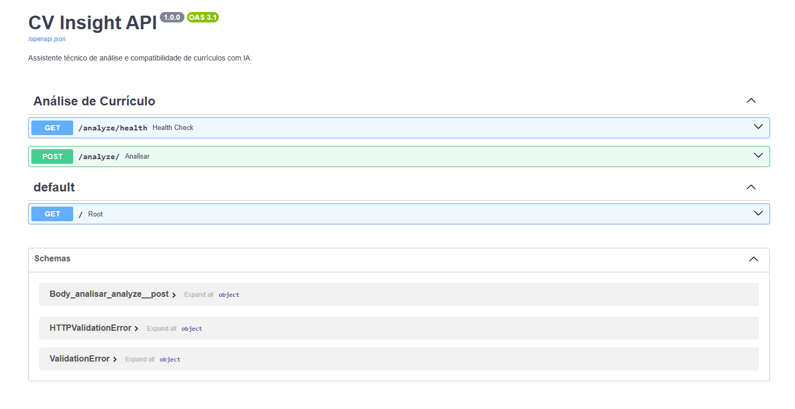
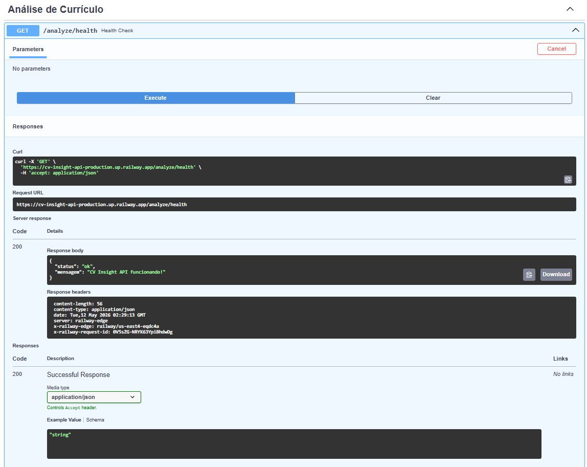
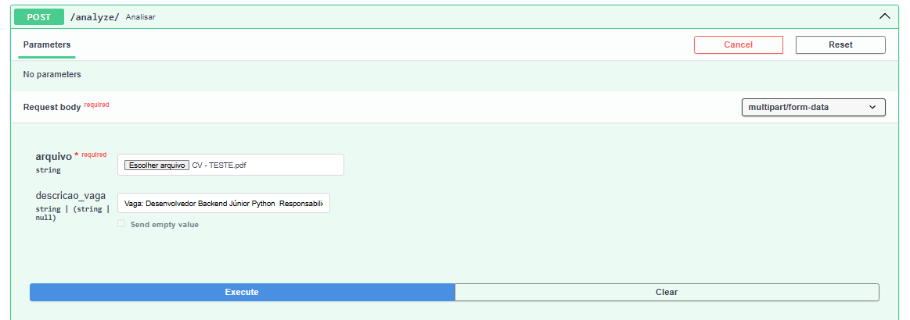
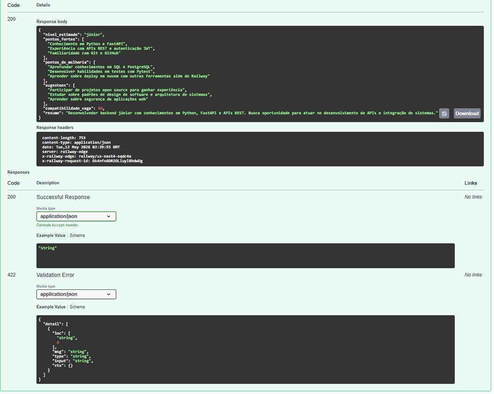

# CV Insight API

Assistente técnico de análise e compatibilidade de currículos com IA.

Projeto desenvolvido para praticar integração com APIs de IA,
processamento de arquivos PDF e boas práticas de desenvolvimento em Python.

## 🌐 API em Produção

👉 **https://cv-insight-api-production.up.railway.app/docs**



---

## O que faz

- Recebe um currículo em PDF
- Extrai e processa o texto automaticamente
- Analisa com IA (LLaMA 3.3 via Groq)
- Retorna um relatório técnico em JSON com:
  - Nível estimado (júnior / pleno / sênior)
  - Pontos fortes identificados
  - Pontos de melhoria
  - Sugestões objetivas
  - Compatibilidade com uma vaga informada (0–100%)

---

## 🛠️ Tecnologias

- Python 3.12
- FastAPI
- PyPDF2
- Groq API (LLaMA 3.3 70B)
- Railway (deploy)

---

## 📌 Endpoints

| Método | Rota | Descrição |
|--------|------|-----------|
| GET | `/analyze/health` | Verifica se a API está no ar |
| POST | `/analyze/` | Analisa currículo em PDF com IA |

---

## Como usar

### 1. Health Check


### 2. Enviar currículo para análise


### 3. Resultado da análise


---

## ⚙️ Como rodar localmente

```bash
# Clone o repositório
git clone https://github.com/isawc/cv-insight-api.git
cd cv-insight-api

# Crie e ative o ambiente virtual
py -3.12 -m venv venv
venv\Scripts\activate

# Instale as dependências
pip install -r requirements.txt

# Configure as variáveis de ambiente
cp .env.example .env
# Edite o .env com sua chave da Groq API

# Rode o servidor
uvicorn app.main:app --reload
```

Acesse: http://localhost:8000/docs

---

## 📁 Estrutura do projeto
cv-insight-api/
├── app/
│   ├── main.py            # Entrada da aplicação
│   ├── config.py          # Configurações e variáveis de ambiente
│   ├── pdf_extractor.py   # Extração de texto de PDFs
│   ├── ai_analyzer.py     # Integração com IA (Groq)
│   └── routers/
│       └── analyze.py     # Rotas de análise
├── requirements.txt
├── runtime.txt
└── README.md
---

Desenvolvido por [Isaac Alvarenga](https://github.com/isawc)